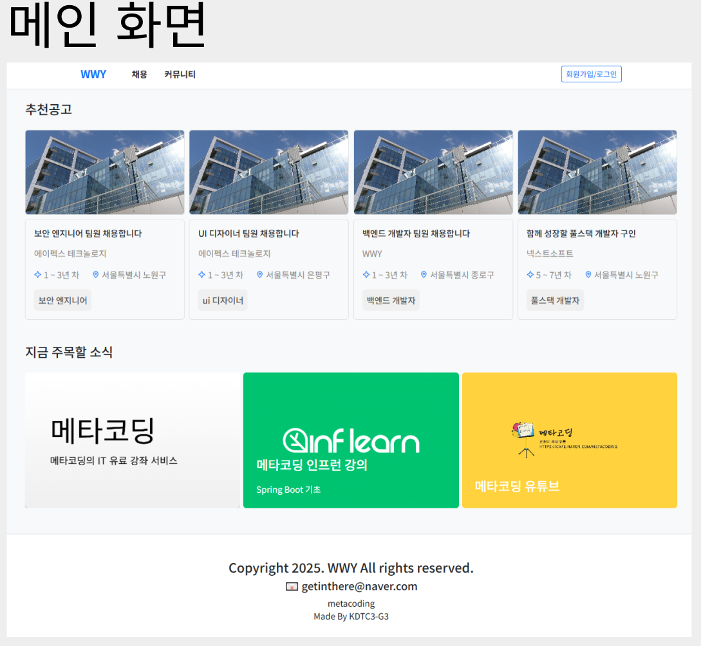
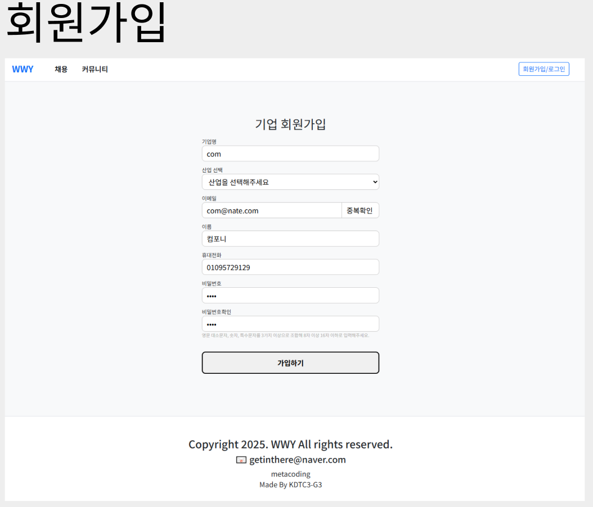
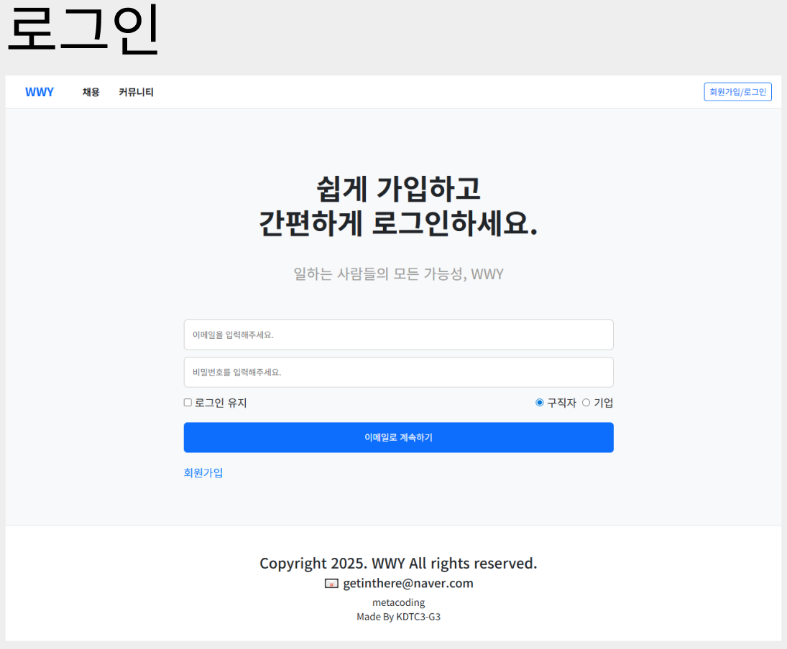
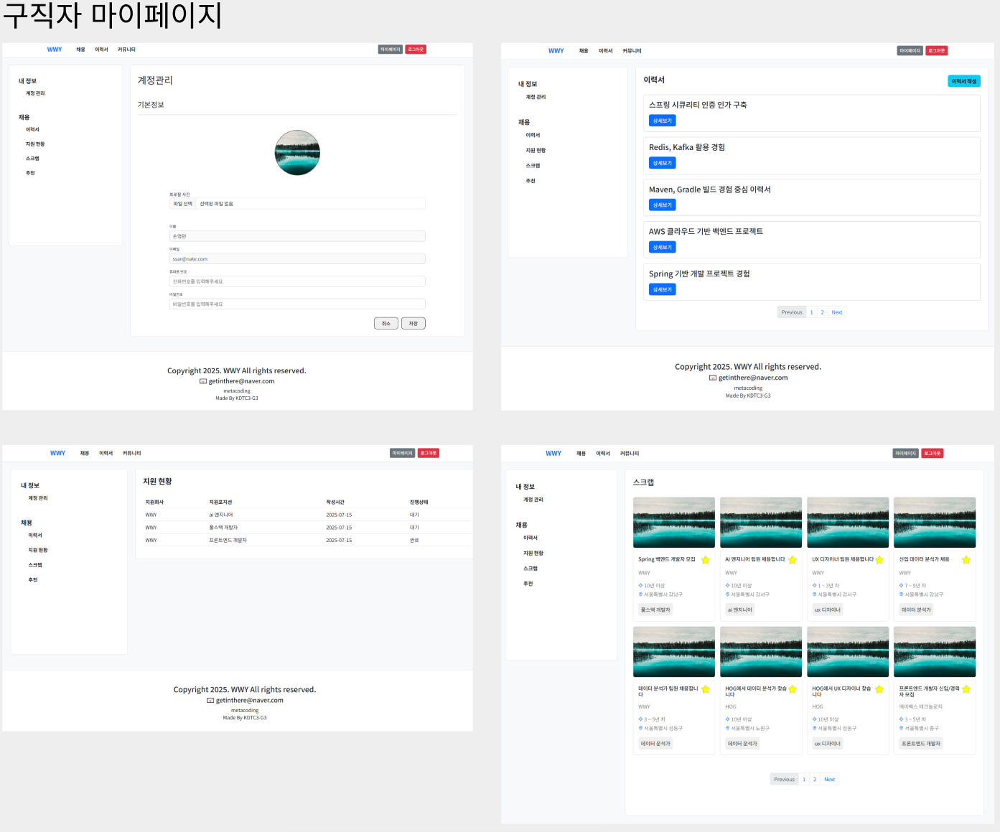
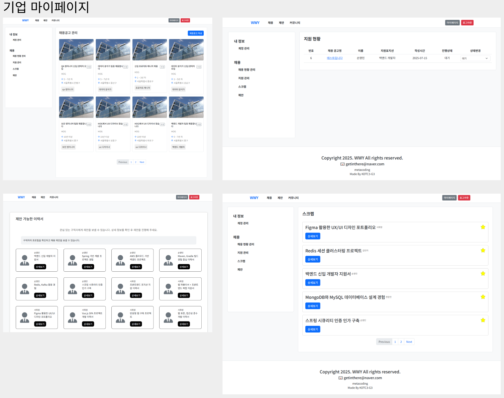
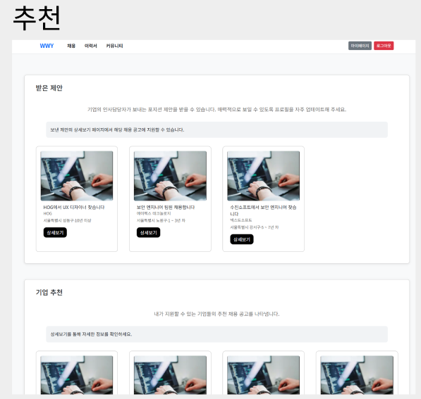
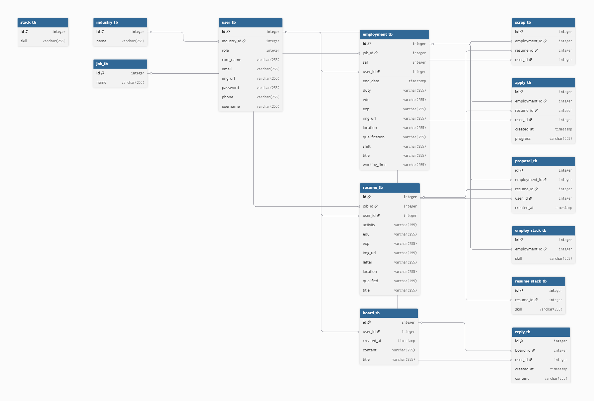

# 목차

1. [💡 프로젝트 소개](#프로젝트-소개)
2. [👥 팀원](#팀원)
3. [🧠 핵심 기능](#핵심-기능)
4. [🖼️ 화면 구성](#화면-구성)
5. [🗂️ ERD](#erd)
6. [🎥 시연 영상](#시연-영상)
7. [🔧 보완할 점](#보완할-점)
8. [📝 프로젝트 후기](#프로젝트-후기)
9. [📏 코드 컨벤션](#코드-컨벤션)

# 프로젝트 소개

### 웹 설명

WWY는 구직자와 기업을 이어주는 채용공고 웹 사이트 입니다.
 
원티드와 프로그래머스의 채용공고 페이지를 벤치마크하여 제작하였습니다.

### 프로젝트 기간

    2025. 04. 11 ~ 2025. 05. 02

### Developed With

### Stacks Used

### Cooperated With

 

# 팀원

|                                                          문정준                                                           |                                                           손영민                                                            |                                                       서회정                                                        |                                                        편준민                                                        |
|:----------------------------------------------------------------------------------------------------------------------:|:------------------------------------------------------------------------------------------------------------------------:|:----------------------------------------------------------------------------------------------------------------:|:-----------------------------------------------------------------------------------------------------------------:|
|  |  |  |  |
|                                                           팀장                                                           |                                                            팀원                                                            |                                                        팀원                                                        |                                                        팀원                                                         |
|                                           [GitHub](https://github.com/Sxias)                                           |                                           [GitHub](https://github.com/son7571)                                           |                                      [GitHub](https://github.com/clubnerdy)                                      |                                      [GitHub](https://github.com/JunMin0529)                                      |

 

 

# 핵심 기능

## 유저 관련 기능

- 로그인
- 회원가입
- 회원수정

## 채용 관련 기능

### 구직자

- 이력서 관리
- 이력서 지원
- 채용 공고 즐겨찾기
- 채용 공고 추천받기

### 기업

- 채용 공고 관리
- 지원 현황 관리
- 구직자에게 채용 공고 추천하기
- 이력서 즐겨찾기

### 공통

- 이력서 또는 채용 공고 매칭

# 화면 구성

### 메인화면

### 회원가입

### 로그인

### 구직자 마이페이지

### 기업 마이페이지

### 추천

# ERD

# 시연 영상

# 보완할 점
- 오류 발생 시 클라이언트 측에 상세한 피드백을 전달하지 못한 점
- 채용 공고 목록 화면에 즐겨찾기 기능이 누락된 점
- SNS 회원가입 기능이 구현되지 않은 점
- 이메일 중복 체크 및 입력값 유효성 검사 등 보안 관련 처리가 미흡했던 점

# 프로젝트 후기
- 처음부터 끝까지 직접 프로젝트를 구현하면서 설계, 개발, 테스트 등 전반적인 과정을 경험하며 개발자로서 한 단계 성장할 수 있었습니다.
- 팀원들과의 협업 과정에서 효과적인 소통과 역할 분담이 프로젝트 완성도에 얼마나 중요한지 몸소 느낄 수 있었습니다.
- 일정 관리에 대한 경험이 부족해 계획한 기능을 모두 구현하지 못한 점이 아쉬웠고, 이를 계기로 더 현실적인 일정 계획과 우선순위 설정의 필요성을 배웠습니다.
- CSR 구조로 개발하면서 처음엔 책임 분리가 되지 않아 코드 가독성과 유지보수성이 떨어졌지만, 점차 컴포넌트 단위로 역할을 명확히 나누는 방법을 익히며 구조적인 사고를 키울 수 있었습니다.

# 코드 컨벤션

https://getinthere.notion.site/Code-Convention-1d58a08b6c0d805db749d4db6cfc9637?pvs=4
